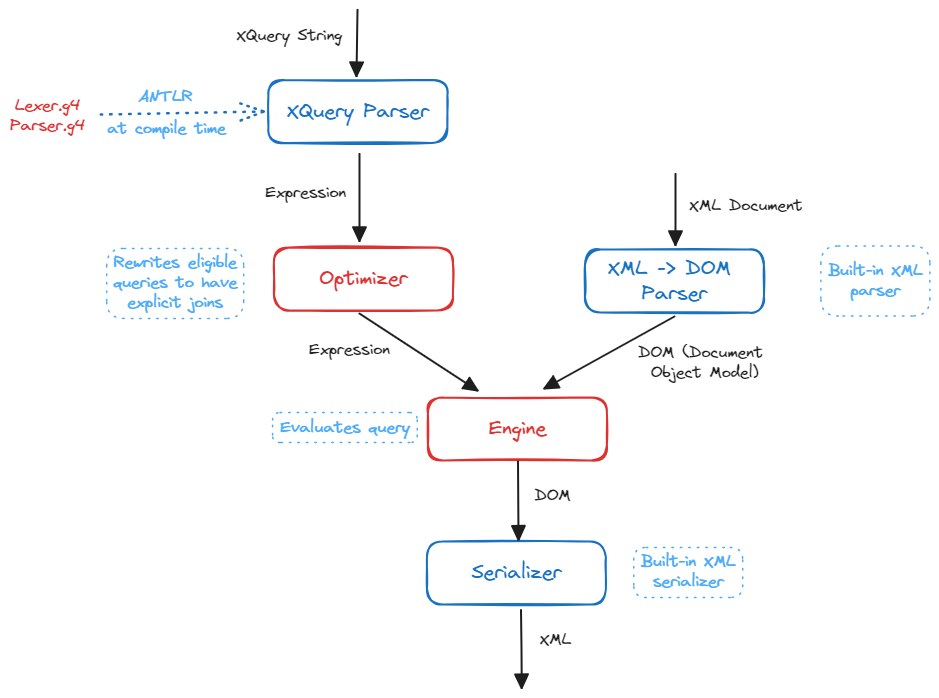

<p align="center"></p>

<p align="center"></p>

<p align="center>


[](https://opensource.org/licenses/MIT)

</p>

XMLAlchemy is a command line tool that can be used to parse XML files and evaluate queries. It supports the following operations:
1. Evaluate XPath expressions.
2. Evaluate XQuery expressions.
3. Rewrite certain class of XQuery expressions and optimize its evaluation.

XPath and XQuery references specifications can be found [here](./docs/xpath-and-xquery-semantics.pdf), where as join optimizations can be found [here](./docs/join-optimizations.pdf).

## Setup

1. `mvn clean install -U` to install the dependencies.
2. `mvn test` to run the tests.
3. `mvn clean package` to package the project and create the jar file.
4. `java -jar target/xmlalchemy-1.0.0.jar --help` to run the program.

## Authors

1. [Mayank Jain](https://jainmayank.me)
2. [Jonathan Woenardi](https://github.com/jonathanwoenardi)

## Architecture

### Directory Structure

```plaintext
├── main                                   # Main source code
│   ├── antlr4                             # ANTLR4 grammar files
│   │   └── edu/ucsd/xmlalchemy
│   ├── java
│   │   └── edu/ucsd/xmlalchemy            # Main package
│   │                ├── xpath             # Classes for XPath expressions
│   │                ├── xquery            # Classes for XQuery expressions
│   │                ├── Expression.java   # Interface which all other expressions implement
│   │                ├── Formatter.java    # Format XQuery expressions
│   │                ├── Optimizer.java    # Rewrite and optimize XQuery expressions
│   │                ├── Visitor.java      # Parses query and constructs IR/expressions
│   │                ├── XPath.java        # XPath CLI
│   │                └── XQuery.java       # XQuery CLI
│   └── resources/style.xslt               # Style file for formatting XML output
├── test                                   # Test source code
│   ├── java
│   │   └── edu/ucsd/xmlalchemy            # Main package
│   └── resources
│        └── milestone{1,2,3}              # Test cases for each milestone
│           ├── document                   # XML files
│           ├── input                      # Input queries
│           └── output                     # Expected output and rewritten queries
├── README.md                              # This file
└── pom.xml                                # Maven configuration file
```

### Program Flow



## Highlights

1. Internal representation for all kinds of XQuery constructs which provides modularity, extensibility, and rewriting without string manipulation.
2. Implement Wong-Youseffi algorithm for join order optimization.
3. Optimize hash-based join by choosing the smaller table to build the hash table.
4. Cache file reads for better performance.
5. Implement custom serializer and formatter for XQuery queries.
6. CLI for evaluating XPath and XQuery expressions with support for output and optimize flags.
7. Maven project setup for dependency management and build automation.
8. 100% test coverage powered by a comprehensive and fully-automated test suite with ~100 test cases testing evaluation, serialization and query rewriting.

## References

1. ANTLR tutorials and best practices:
   * [ANTLR4](https://www.antlr.org/) and [ANTLR Lab](http://lab.antlr.org)
   * [Best practices for ANTLR parsers](https://tomassetti.me/best-practices-for-antlr-parsers/)
   * [Listeners and Visitors](https://tomassetti.me/listeners-and-visitors/)
   * [ANTLR Mega Tutorial](https://tomassetti.me/antlr-mega-tutorial/#chapter47)
2. [XPath and XQuery Semantics](./docs/xpath-and-xquery-semantics.pdf)
3. [Join Optimizations](./docs/join-optimizations.pdf)
4. W3C Document and Node API:
   * [Node](https://docs.oracle.com/javase%2F7%2Fdocs%2Fapi%2F%2F/org/w3c/dom/Node.html)
   * [Document](https://docs.oracle.com/en/java/javase/11/docs/api/java.xml/org/w3c/dom/Document.html)
5. [BaseX](https://basex.org/) and [xpather.com](http://xpather.com/) for XPath and XQuery reference evaluation.
6. [Debugger](https://code.visualstudio.com/docs/java/java-debugging#_debug-session-inputs) for Java in Visual Studio Code.